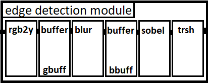
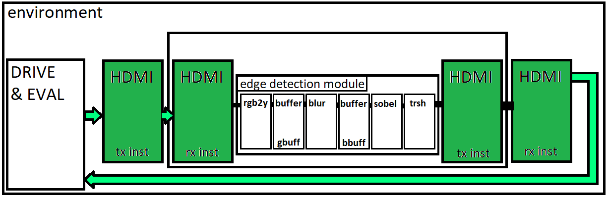

### Feladatkiírás

Az éldetektálás egy fontos eleme a gépi látásnak a képfeldolgozási feladatoknak. Az egyes szoftveres megvalósítások rendelkeznek a módosíthatóság és az egyszerűbb implementálhatóság könnyebbségével. Ugyanakkor a hardveres megvalósítások sokkal gyorsabbak és újraprogramozható eszközök pedig mindkét oldal előnyével rendelkeznek.

A félév során ismerkedjen meg az éldetektálási lehetőséggekkel és algoritmusokkal. A konzulenssel egyeztetve válasszon ki éldetektálási algoritmusokat, dolgozza ki azok hardveres megvalósítására alkalmas gyorsító IP mag fejlesztési lépésit.

A hallgató feladatának a következőkre kell kiterjednie:
 - Ismerje meg és mutassa be az éldetektálás módjait!
 - Ismerje meg és mutassa be FPGA alapú rendszerek hardveres gyorsítással lehetőségeit.
 - Készítsen platformfüggetlen éldetektálásra alkalmas IP rendszertervét és az almodulok funkcionális és interfészspecifikációját.
 - Határozza meg a rendszer szintézis- és futásidejű paramétereit.
 -  Készítse el az IP mag technológiafüggetlen, szintetizálható RTL modelljét VHDL vagy SystemVerilog nyelven.
 -  Az elkészített RTL modell funkcionális verifikációjához készítsen automatizált regressziós tesztelésre alkalmas HDL tesztkörnyezeteket.
 -  Szintetizálja az RTL modellt a konzulenssel egyeztetett technológiára.
 -  Végezzen statikus időzítésvizsgálatot és időzítési szimulációt.
 -  Ellenőrizze a rendszer működését valós áramköri környezetben.

### Tartalomjegyzék

1. [Bevezetés                               ](#Bevezetes)
2. [Irodalomkutatás                         ](#bibliography)
3. [Felhasznált eszközök                    ](#tools)
4. [Rendszerterv                            ](#system)
5. [Implementáció                           ](#implementation)

### Bevezetés

A képfeldolgozás és a gépi látás során a cél, hogy a képekből illetve képkockákból jellegzetességet, vonást, információt nyerjünk ki. Ezek az információk lehetnek pontok, élek vagy teljes objektumok, de neurális hálókkal absztraktabb tulajdonságok és jellegzetességek is felismerhetőek.

Az éldetektálás egy fontos lépése a hagyományos programozási eszközökkel történő képfeldolgozásnak. A képfeldolgozási folyamatok gyorsítására, vagy akár a Neurális Hálók alkalmazásánál az képi információk előfeldolgozására alkalmas lehet. Segítségével kiemelhetünk számunkra lényeges információkat és könnyen lecsökkenthetjük az adatmennyiséget és a komplexitást, amivel dolgozni szeretnénk.

A legelterjedtebb alkalmazási módja az egyes képfeldolgozási algoritmusoknak a orvosi alkalmazásokban, a robotika és a önvezető járművek gépi látása során vagy objektumok, dolgok beazonosítására szatelit képeken, kamera felvételeken (ide értve különösképpen az arcfelismerést).

### Irodalomkutatás, felhasználási lehetőségek, motiváció

### Felhasznált eszközök

A hardverben történő megvalósításhoz a konzulensemtől kapott Xilinx Kintex-7-es FPGA-t tartalmazó kártyát használtam. A fejlesztés során a kártya miatt a Xilinx Vivado környezetét használtam, így tudtam a megfelelő programozó fájokat elkészíteni. A fejlesztés egy jelentős szakaszában kizárólag , így ellenőríztem az egyes bugokat és csak akkor szintetizáltam le és töltöttem fel a kártyára, amikor már bizonyos voltam abban, hogy az elvárt működést fogja produkálni a rendszer.

### Rendszerterv

<!-- A rendszerterv több lépésben is változtatásra került, ugyanakkor mindössze bővítésre, illetve a Kintex-7 es chipen elérhető konkrét erőforrásokra optimalizált megoldások kerültek bele. -->

A topmodul négy paraméterrel rendelkezik. Szükséges megadni a képkockák maximális szélességét, ezáltal nincs kihasználatlan memória. Abban az esetben, ha a fogadott képkocka nem éri el a paraméterben megadott szélességet, viszont ez le van követve a vezérlőjelekkel, akkor nincs probléma. A vezérlőjelek alapján a rendszer tudja mikor érkezik az új sor, a memória modul lesz részben kihasználatlan. Abban az esetben, ha inkoherens a bemenet az elvárthoz képest, a kimeneti adat is nemdeterminisztikus lesz. A második paraméter a színmélység, az egy színben található bitek számával szükséges megadni. Alacsonyabb színmélységű képkockák esetén nem jelent hátrányt, amennyiben a bementi adat legmagasabb bitje a legmagasabb bitpozícióra kerül az eszköz bemenetén. A POL_VS és POL_HS a bemeneti vezérlőjelek polaritását adja meg, alacsony aktív vezérlőjelek esetén a modulon belül invertálásra kerülnek a jelek, hogy azok könnyen használhatóak maradjanak.

Portok:
- clk, rst: A modul órajele, és reset jele. Minden esetben a pixel órajelet javasolt használni, a modul nem rendelkezik külön bemeneti metastabilszűréssel.
- sw: Bemeneti kapcsolókombinációk megadására alkalmas port, használat közben módosítható a belső struktúra, egyes elemek ki és bekapcsolásával.
- red_i, green_i, blue_i: A bemeneti adatok, a modul bementei órajelével való szinkronitást biztosítania kell a felhasználónak.
- dv_i: A bemeneti adathoz tartozó vezérlőjel. A dv_i jel aktív magas, ha a bemeneten érvényes adatok szerepelnek az adott órajelciklusban. 
- hs_i, vs_i: A kijelző eszköz vezérlőjele. A hs_i és vs_i a függőleges és horizontális szinkronizáció információját hordozzák, az egyes almoduloknak ezeket kell késleltetnie, hogy az adat helyesen jelenjen meg a képernyőn.
- red_o, green_o, blue_o: A kimeneti adatok. A megvalósítutt funkciót tekinte szürkeárnyalatosak a pixelek, de igazodva bemenethez és egy potenciális következő fokozathoz, a kimenet is három szín széles.
- dvo_o, hs_o, vs_o: A kimeneti, megfelelően késleltett vezérlőjelek.

Az eszközön belüli almodulok közel azonos paraméterkiosztással és portokkal rendelkeznek, csupán a számukra, vagy a pipelineban a közvetlen szomszédjukban álló modul egyedi igényeihez mérten tartalmaznak többlet portokat illetve paramétereket.

#### RGB2Y

Az rgb2y modul a pixeladatokból történő világosságkomponens kiszámításáért felelős. A modul portja és paraméterei közel azonosak a topmodul portjaival és bemeneteivel, ez az ábrán látható modulekomponensből is látszódik

#### buffer

#### blur

#### sobel

### Implementáció

### Verifikáció
